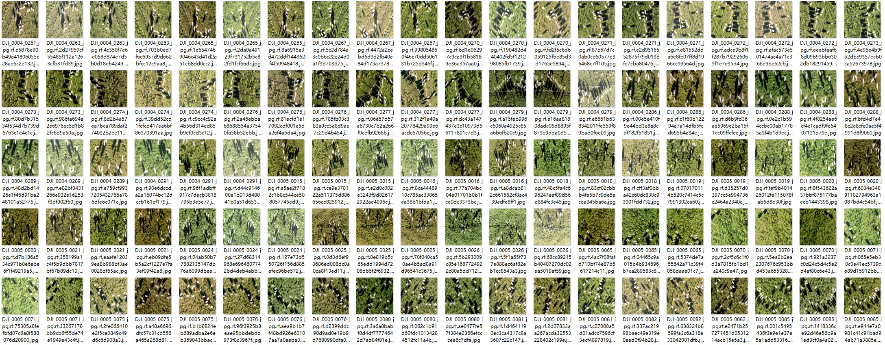
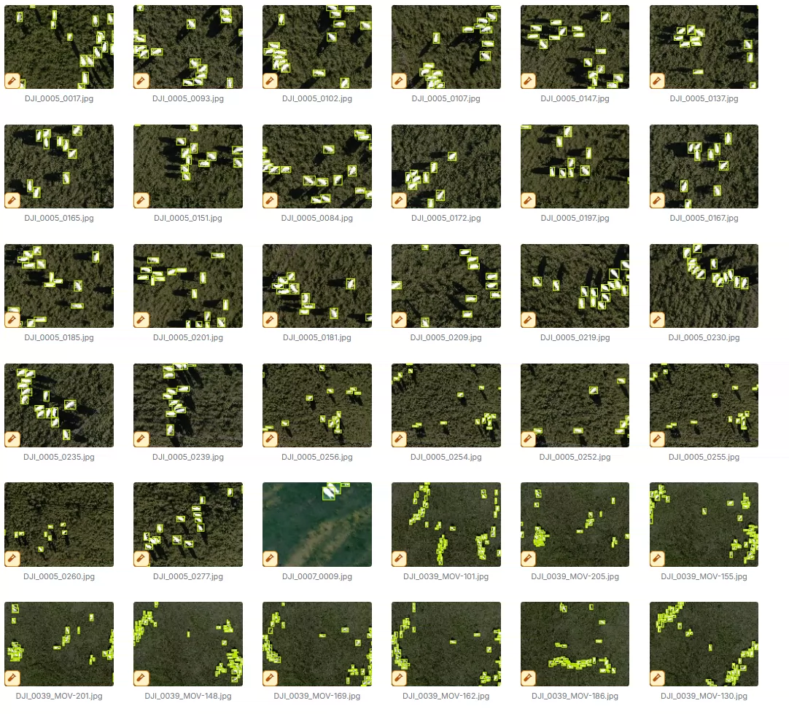
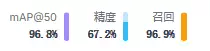
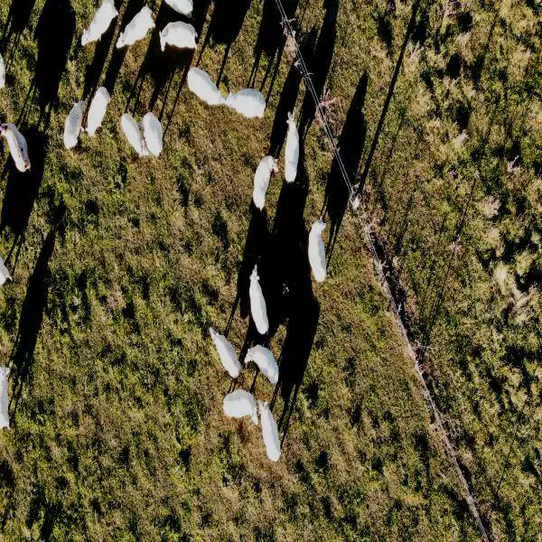
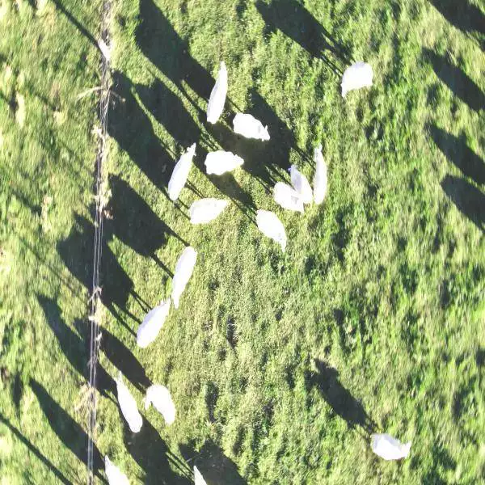
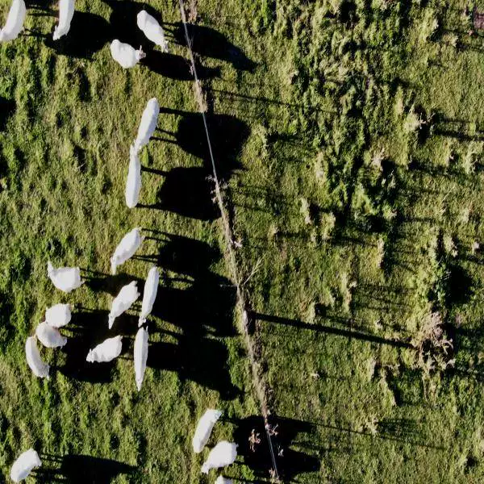

## Body

Drone Airborne Sheep Count Dataset in YOLO format

Totally 3933 images, each labeled in YOLO format. The training set (3409), validation set (350), and test set (174) are well-defined.

The dataset is divided into one class, namely sheep.

Electronic virtual products sold are not returnable.

## Images

Here is a pay link on Stripe ( https://buy.stripe.com/3cs8yP7sY87d0vu9AB ). Please contact me lonlonago@foxmail.com after funding $89, and I will send you a complete data files , thank you!

